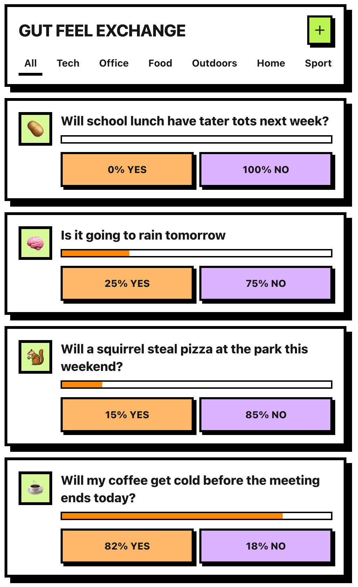

<div align="center">

# Gut Feel Exchange



Fake money. Real confidence. Thicc borders. Thin evidence.

Live demo: https://gut-feel-exchange.pages.dev

</div>

## What is this?
A mobile-first, vibes-based prediction exchange. Place pretend dollars on obviously serious questions like “Will the printer jam while the boss is watching?” Everyone shares the same list via a communal cloud brain. What could go wrong.

No client storage is used (we ate all the cookies).

## Features
- Weighted votes: $1 / $10 / $100 / custom.
- Trending by total clicks (“extremely scientific”).
- Add your own predictions — one emoji per prediction to prevent emoji monopolies.
- Brutalist UI — borders so chunky they should pay rent.
- Cloudflare KV — one shared chalkboard for all.

## Stack
- Next.js 15 (App Router) → static export in `out/`.
- React 19 + TypeScript 5.
- Tailwind v4 (`app/globals.css` has brutalist helpers).
- Cloudflare Pages + Pages Functions + KV.

## Quick Start
```bash
npm install
npm run dev
```
Dev opens http://localhost:3000 and proxies `/api/*` to Wrangler on http://127.0.0.1:8788.

Build/preview:
```bash
npm run build
npm start
```

## Deploy (Cloudflare Pages)
1) Create or bind a KV namespace as `PREDICTIONS_KV`.
   - `npx wrangler kv namespace create PREDICTIONS_KV`
2) Optional: seed it with sample nonsense.
   - `npm run cf:seed`
3) Deploy.
   - `npm run cf:deploy` (runs export then `wrangler pages deploy ./out --project-name=gut-feel-exchange`)

Static export only. No SSR/ISR. All beef, no server.

## API (you’ll barely need it)
- `GET /api/predictions` — list predictions.
- `POST /api/predictions` — add one `{ question, icon, category }`.
- `POST /api/predictions/:id/vote` — `{ side: "yes"|"no", stake }`.
Data lives under KV key `predictions/all`. New items start at 50/50 to keep the peace.

## Contributing
- Conventional Commits please (e.g., `feat(app): add stake picker`).
- `npm run lint` before PRs. Keep diffs tidy. Bring jokes.

## Safety
- Not gambling. Not money. Predict responsibly.
- License: if absent, assume “look but don’t sue”; otherwise see `LICENSE`.
